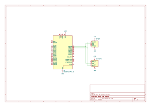

# Raspberry Pi Pico 2W based node
This is the driver for the RP Pico 2W node version. **Up to 2 flowers**

## Node Capabilities
The main limitation of this node is that there are only 3 ADC peripherals onboard. Giving up one for the water level leaves us just 2 for the flowers

| Telemetry       | Hardware                                                                                                 | Interface     |
|-----------------|----------------------------------------------------------------------------------------------------------|---------------|
| Water tank      | Water level sensor (exact level)                                                                         | Analog        |
| Temperature     | [BMP280](https://www.bosch-sensortec.com/media/boschsensortec/downloads/datasheets/bst-bmp280-ds001.pdf) | Digital / I2C |
| Pressure        | [BMP280](https://www.bosch-sensortec.com/media/boschsensortec/downloads/datasheets/bst-bmp280-ds001.pdf) | Digital / I2C | 
| Light Intensity | [BH1750FVI](https://www.alldatasheet.com/datasheet-pdf/view/338083/ROHM/BH1750FVI.html)                  | Digital / I2C |

## Schematics


## Flashing
### Wi-Fi credentials
Before flashing this node, create the `firmware/secrets/` directory, and provide there the Wi-Fi credentials.
`build.rs` would verify their existance, but not their correctness, so please double-check.
`secrets` should contain 3 files:
1. `ip.txt` => IP address of the backend server within connected network
2. `password.txt` => Wi-Fi password
3. `ssid.txt` => Wi-Fi SSID (network name)

In order to get the server IP, on server's host-machine run:
#### Linux
Run: 
```
hostname -I
```
The first IP address is the one you need
#### Windows
TODO
#### MacOS
TODO

### Using the Debug Probe
If you have the debug probe connected just run the following in this directory:
```
cargo run --release
```

### Using picotool (no debug probe)
TODO

## Full hardware list
TODO